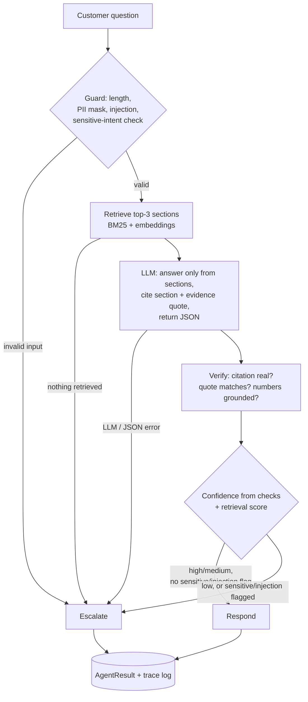

# Policy-Aware Customer Support Agent

A small agent that answers customer questions from policy/FAQ docs, grounds every
answer in a cited section, and escalates to a human when it isn't confident.

## Tech stack

| Layer            | Choice                                                                                                      |
| ---------------- | ----------------------------------------------------------------------------------------------------------- |
| Language         | Python 3.13                                                                                                 |
| LLM              | Groq (`openai/gpt-oss-120b`, OpenAI-compatible API) — local Ollama (`qwen3.5:9b`) as a fallback        |
| Retrieval        | BM25 (`rank_bm25`) + local sentence embeddings (`BAAI/bge-small-en-v1.5` via `sentence-transformers`) |
| Validation       | Pydantic (LLM output, final result, and trace-log schemas)                                                  |
| Grounding checks | `rapidfuzz` (citation fuzzy-match) + regex (number extraction)                                            |
| UI               | Streamlit                                                                                                  |
| Testing          | `pytest` (47 unit tests, fake LLM client, no API key needed) + a custom eval harness (15 cases)           |

**Design philosophy:** optimized for *never confidently wrong* over *always answering* — every
escalate is a deliberate decision, not a fallback for what the code couldn't handle. Confidence is
*verifiable* (citation and number checks against the retrieved text), not self-rated by the LLM.
The provider is swappable by environment variable, not hardwired, so this isn't locked to one vendor.

## Setup and run

```bash
python -m venv .venv && source .venv/Scripts/activate   # .venv/bin/activate on Mac/Linux
pip install -r requirements.txt
cp .env.example .env   # fill in LLM_API_KEY for Groq (free tier), or use the Ollama block instead
```

For the local Ollama fallback instead of Groq: uncomment the Ollama block in `.env`
(needs `ollama pull qwen3.5:9b` and `ollama serve` running).

```bash
python -m src.main --question "What charges apply if my EMI auto-debit bounces?"
python -m src.main --batch      # runs all 5 sample questions in data/questions.json
streamlit run app.py            # web UI: Ask tab + Metrics tab
pytest -q                       # 47 unit tests, no API key needed (fake LLM client)
python -m eval.run              # 15-case eval, writes eval/results.md
```

`data/policies/` holds 3 sample policy docs in .md format.

## How does this solution work?

A question first passes guard checks (length, PII masking, prompt-injection and sensitive-intent
detection) before anything reaches the LLM. The retriever splits the policy docs into `##`
sections and ranks them with a BM25 + local-embedding hybrid (top-3, no vector DB). The LLM (Groq,
OpenAI-compatible) is prompted to answer only from those sections, cite one section id, and quote
verbatim evidence, returned as JSON. A verification step confirms the citation is real, the quote
matches the section text, and every number in the answer appears in that section. Confidence comes
only from these checks plus the retrieval score, never the LLM's self-rating, and low confidence,
an unanswerable question, or a sensitive/injection flag all force `action: escalate`.



## Why did I choose this model/framework/approach?

Groq's free tier gives fast (1-4s), OpenAI-compatible access to an open-weight model
(`openai/gpt-oss-120b`), so the same `openai` client code runs unchanged against a local Ollama
fallback. BM25 + a small local embedding model (`bge-small-en-v1.5`) gives
keyword and semantic matching without a vector database, which fits ~20 short policy sections.
Pydantic validates every LLM response and the final result so a malformed response is caught
immediately. Confidence/escalation logic is plain Python over checkable signals (citation match,
number match, retrieval score), deliberately not LLM-judged — an LLM rating its own confidence
isn't falsifiable.

## Example input and output

```
$ python -m src.main --question "What charges apply if my EMI auto-debit bounces?"
{
  "query": "What charges apply if my EMI auto-debit bounces?",
  "category": "emi_payments",
  "answer": "A bounced auto-debit incurs a Rs. 500 bounce charge per instance plus 18% GST, added to the next month's statement.",
  "source": "emi_payments#bounce-charges",
  "confidence": "high",
  "action": "respond"
}
```

Full eval results (15 cases: paraphrases, not-covered, account-specific, injection, PII, Hinglish)
are in `eval/results.md` — 100% routing accuracy, 0% false-respond rate on Groq.

## Where this could still go wrong

- **Conflicting numbers across sections.** If two retrieved sections both mention a similar
  figure (e.g. a general fee vs. a special-case fee), citation checks confirm the cited section is
  real and the quote is real, but nothing catches the LLM citing the *right* section for the
  *wrong* reason. Would need an independent second-pass re-grounding check to catch this reliably.
- **Stale policy content.** Verification confirms an answer matches what's in `data/policies/`
  right now, not that it's current. Without versioning or a re-index trigger on every policy
  update, a real deployment would confidently and correctly cite an outdated fee.

## What needs improvement before production use?

- A larger, curated eval set and threshold tuning against real historical support tickets, the
  current 15 hand-written cases are enough to catch regressions, not enough to fully trust the
  confidence thresholds.
- NER-based PII redaction instead of regex, which misses names, exact addresses, and non-standard
  ID formats.
- Multi-turn conversation memory (every question is currently stateless).
- A human-in-the-loop review queue for escalated cases, wired to a real ticketing system instead
  of a local JSONL trace log.
- Rate limiting / backoff and concurrent request handling for LLM calls, currently one blocking
  call with a single retry.

## What is one important security or governance concern in financial services?

Customer PII (PAN, Aadhaar, phone, email, loan account numbers) must never reach a third-party LLM
or the logs, under India's DPDP Act this is both a compliance and trust requirement, and
`guard.py` masks every such pattern before anything leaves the process. Just as important for an
NBFC lender: RBI's Digital Lending Guidelines hold the regulated entity responsible for the
accuracy of customer-facing loan information regardless of channel, so an LLM inventing a fee or
interest figure isn't just a bad answer, it's a mis-selling and compliance risk the lender owns,
not a vendor's problem. `verify.py` checks every number in an answer against the cited policy text
and escalates instead of responding if it doesn't match, the system can be wrong by saying
"I don't know," but not by inventing a number.

## What AI coding tools I used, and how did I use them?

I used Claude and ChatGPT first to research model options and retrieval approaches, then to draft the plan and
architecture. I then built it with Claude Code, one phase at a time (setup, pipeline, tests, eval,
UI), reviewing each phase before moving on rather than accepting one large generation. The test
suite caught real bugs in the generated code before I ran the app by hand: a PII regex that left
the `+` of `+91` numbers unmasked, a BM25 tokenizer that broke on trailing punctuation, and a
generic intro paragraph out-ranking the actual answer section. The eval also surfaced the model
using up its output budget on internal reasoning before ever emitting JSON, rather than chase an
Ollama-version-specific workaround further, I leaned on the fail-closed design already in place:
it treats that as any other provider failure and escalates instead of crashing or guessing.
